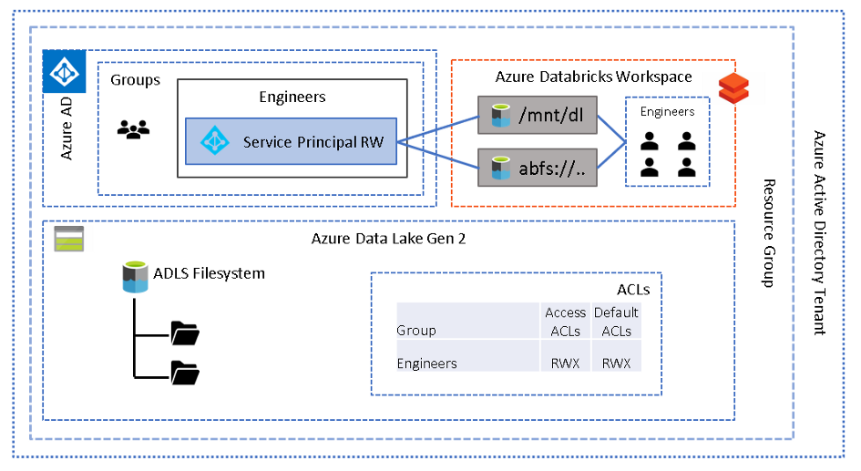
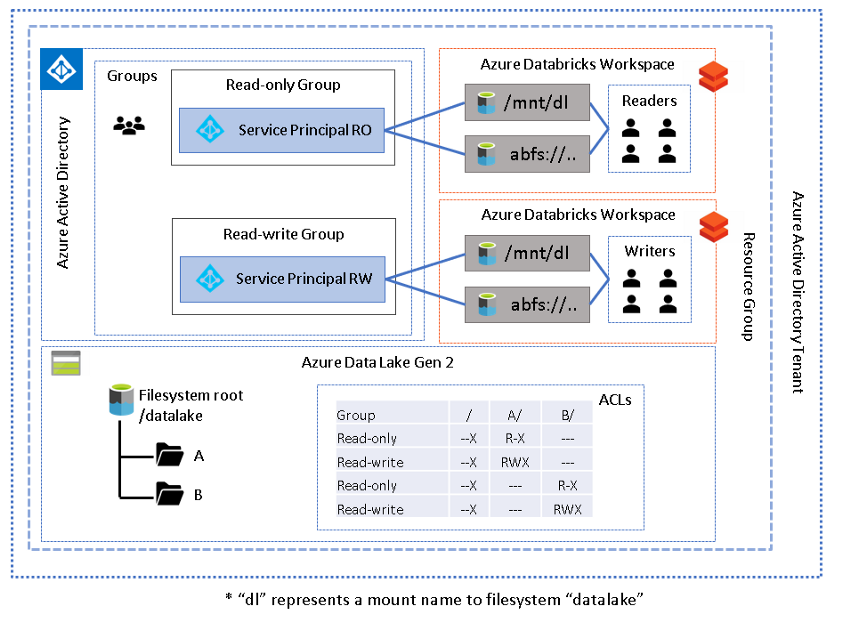

# Securing access to Azure Data Lake Gen 2 from Azure Databricks

**Summary:**

This document attempts to provide customers of Azure Data Lake (ADLS) and Azure Databricks with an introduction of the common approaches in which data can be accessed and secured in ADLS from Databricks.

**Versions:**

| **Name** | **Title** | **Notes** | **Date** |
| --- | --- | --- | --- |
| Nicholas Hurt | Microsoft Cloud Solution Architect – Data &amp; AI | Original | 20 Jan 2020 |
|   |   |   |   |
|   |   |   |   |

** **

# Contents

Introduction

[Pattern 1. Access via Service Principal](#Pattern-1\.-Access-via-Service-Principal)

Pattern 2. Multiple workspaces — permission by workspace

Pattern 3 — AAD Credential passthrough

Pattern 4. Cluster scoped Service Principal

Pattern 5. Session scoped Service Principal

Pattern 6. Databricks Table Access Control

Conclusion

License/Terms of Use


# Introduction

There are a number of ways to configure access to Azure Data Lake Storage gen2 (ADLS) from Azure Databricks (ADB). This document attempts to cover the common patterns, advantages and disadvantages of each, and the scenarios in which they would be most appropriate.

ADLS offers more granular security than RBAC through the use of access control lists (ACLs) which can be applied at folder of file level.  As per [best practice](https://docs.microsoft.com/en-us/azure/storage/blobs/data-lake-storage-best-practices#use-security-groups-versus-individual-users) these should be assigned to AAD groups rather than individual users or service principals. There are two main reasons for this; i.) changing ACLs can take time to propagate if there are 1000s of files, and ii.) there is a limit of 32 ACLs entries per file or folder.

By way of a simple example a data lake may require two sets of permissions. Engineers who run data pipelines and transformations requiring read-write access to a particular set of folders, and analysts who consume [read-only] curated analytics from another. Two AAD groups should be created to represent this division of responsibilities, and the required permissions for each group can be controlled through ACLs. Users should be assigned to the appropriate AAD group, and the group should then be assigned to the ACLs.  Please see [the documentation](https://docs.microsoft.com/en-gb/azure/storage/blobs/data-lake-storage-access-control#access-control-lists-on-files-and-directories) for further details. For automated jobs, a service principal should be used instead of user identity, and these too can be added to the appropriate group. Service principal credentials should be kept extremely secure and referenced only though [secret scopes](https://docs.microsoft.com/en-us/azure/databricks/dev-tools/api/latest/secrets).

For clarity and brevity ADLS in the context of this paper can be considered a v2 storage account with Hierarchical Namespace (HNS) enabled.

## Pattern 1\. Access via Service Principal

To provide a group of users access to a particular folder (and it's
contents) in ADLS, the simplest mechanism is to create a [mount point
using a service
principal](https://docs.microsoft.com/en-gb/azure/databricks/data/data-sources/azure/azure-datalake-gen2?toc=https%3A%2F%2Fdocs.microsoft.com%2Fen-gb%2Fazure%2Fazure-databricks%2FTOC.json&bc=https%3A%2F%2Fdocs.microsoft.com%2Fen-gb%2Fazure%2Fbread%2Ftoc.json#--mount-an-azure-data-lake-storage-gen2-account-using-a-service-principal-and-oauth-20)
at the desired folder depth. The mount point (/mnt/\<mount\_name\>) is
created once-off per workspace but **is accessible to any user on any
cluster in that workspace**. In order to secure access to different
groups of users with different permissions, one will need more than just
a single one mount point in one workspace. One of the patterns described
below should be followed.

*Note access keys are not an option on ADLS whereas they can be used for
normal blob containers without HNS enabled.*

Below is sample code to authenticate via a SP using OAuth2 and create a
mount point in Scala.

```scala
configs = {"fs.azure.account.auth.type": "OAuth",
           "fs.azure.account.oauth.provider.type": "org.apache.hadoop.fs.azurebfs.oauth2.ClientCredsTokenProvider",
           "fs.azure.account.oauth2.client.id": "enter-your-service-principal-application-id-here",
           "fs.azure.account.oauth2.client.secret": dbutils.secrets.get(scope = "enter-your-key-vault-secret-scope-name-here", key = "enter-the-secret"),
           "fs.azure.account.oauth2.client.endpoint": "https://login.microsoftonline.com/enter-your-tenant-id-here/oauth2/token"}

dbutils.fs.mount(
  source = "abfss://file-system-name@storage-account-name.dfs.core.windows.net/folder-path-here",
  mount_point = "/mnt/mount-name",
```
The creation of the mount point and listing of current mount points in
the workspace can be done via the
[CLI](https://docs.microsoft.com/en-gb/azure/databricks/dev-tools/cli/dbfs-cli?toc=https%3A%2F%2Fdocs.microsoft.com%2Fen-gb%2Fazure%2Fazure-databricks%2FTOC.json&bc=https%3A%2F%2Fdocs.microsoft.com%2Fen-gb%2Fazure%2Fbread%2Ftoc.json)

```cli
\>databricks configure --- token

Databricks Host (should begin with ):
https://eastus.azuredatabricks.net/?o=#########
Token:dapi###############
\>databricks fs ls dbfs:/mnt

datalake
```

From an architecture perspective these are the basic components where
"dl" is used to represent the mount name.


*Note the use of default ACLs otherwise any new folders created will be
inaccessible*

The mount point and ACLs could be at the filesystem (root) level or at
the folder level to grant access at the required filesystem depth.

Instead of mount points, access can also be via direct path --- Azure
Blob Filesystem (ABFS - included in runtime 5.2 and above) as shown in
the code snippet below.

To access data directly using service principal, authorisation code must
be executed in the same session prior to reading/writing the data for
example:
```scala
# authenticate using a service principal and OAuth 2.0
spark.conf.set("fs.azure.account.auth.type", "OAuth")
spark.conf.set("fs.azure.account.oauth.provider.type", "org.apache.hadoop.fs.azurebfs.oauth2.ClientCredsTokenProvider")
spark.conf.set("fs.azure.account.oauth2.client.id", "enter-your-service-principal-application-id-here")
spark.conf.set("fs.azure.account.oauth2.client.secret", dbutils.secrets.get(scope = "secret-scope-name", key = "secret-name"))
spark.conf.set("fs.azure.account.oauth2.client.endpoint", "https://login.microsoftonline.com//enter-your-tenant-id-here/oauth2/token")

# read data in delta format
readdf=spark.read.format("delta").load(abfs://file-system-name@storage-account-name.dfs.core.windows.net/path-to-data")
```

Using a single service principal to authenticate users to a single
location in the lake is unlikely to satisfy most security requirements
-- it is too coarse grained, much like RBAC on Blob containers. It does
not facilitate securing access to multiple groups of users of the lake
who require different sets of permissions. One or more the following
patterns may be followed to achieve the required level of
granularity.


Pattern 2. Multiple workspaces --- permission by workspace
==========================================================

This is an extension of the first pattern whereby multiple workspaces
are provisioned, and different groups of users are assigned to different
workspaces. Each group/workspace will use a different service principal
to govern the level of access required, either via a configured mount
point or direct path. Conceptually, this is a mapping of service
principal to each group of users, and each service principal will have a
defined set of permissions on the lake. In order to assign users to a
workspace simply ensure they are registered in your Azure Active
Directory (AAD) and an admin (those with [contributor or owner role on
the
workspace](https://docs.microsoft.com/en-us/azure/databricks/administration-guide/account-settings/account#assign-initial-account-admins)
will need to [add
users](https://docs.microsoft.com/en-us/azure/databricks/administration-guide/users-groups/users#--add-a-user)
(with the same identity as in AAD) to the appropriate workspace. The
architecture below depicts two different folders and two groups of users
(readers and writers) on each.



This pattern may offer excellent isolation at a workspace level however
the main disadvantage to this approach is the proliferation of
workspaces --- n groups = n workspaces. The workspace itself does not
incur cost, but there may be an inherit increase in total cost of
ownership. If more granular security is required than workspace level then
one of the following patterns may be more suitable.
